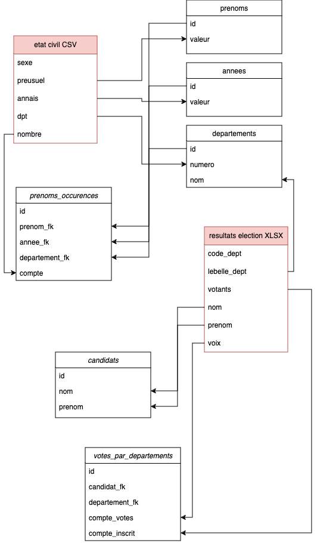

# A propos
Le but de ce projet est de coréler les registres d'éta civile et les données relative aux éléctions présidentielles 2022. 
Suite à un procéssus ETL, nous allons coréléer ces données grâce à des requêtes SQL effectuées sur la base de donnée Postres et donner le résultat dans l'IHM créé à cet effet.
# Architecture BDD
_voici un diagram d'architecture de données. Les tables en `rouge` représantent des sources de données à plat._

# Startup
_le projet dépend de `python 3.12` et de `docker_

## Infrastructure
Lancer les contenaires
```bash
docker-compose up -d
```
Une fois les contenaires en cours d'execution, vous pouvez consulter pgadmin
```bash
http://localhost:15432/
```
## Projet
### Création de l'environnement
#### Windows (batch/powershell)
```bash
python -m pip install poetry
```
```bash
cd ./data_dumper
```
```bash
python -m poetry install
```

#### Unix (bash/zsh)

```bash
python3 -m pip3 install poetry
```
```bash
cd ./data_dumper
```
```bash
python3 -m poetry install
```
### Execution de la pipeline ETL
#### Windows (batch/powershell)

```bash
python -m poetry run python main.py import
```

#### Unix (bash/zsh)

```bash
python3 -m poetry run python3 main.py import
```
### Execution de l'IHM
#### Windows (batch/powershell)

```bash
python -m poetry run python main.py desktopui
```

#### Unix (bash/zsh)

```bash
python3 -m poetry run python3 main.py desktopui
```
